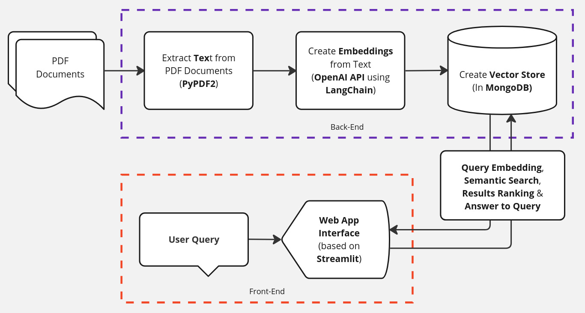
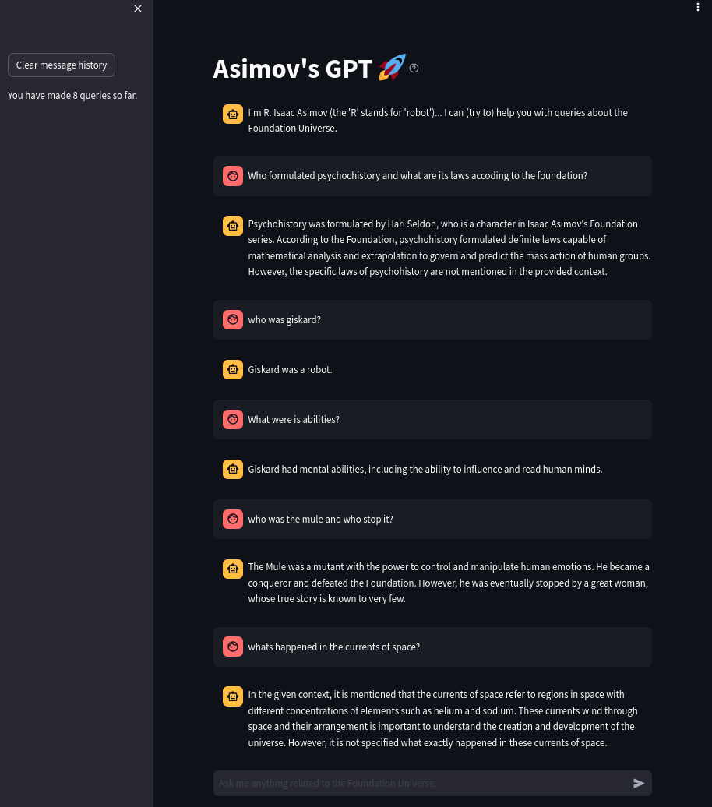

# AsimovGPT

**Short for "Asimov's Foundation Universe GPT" Version 1.0**

Link to tool: https://asimovfoundationuniversegpt.streamlit.app/

Here you can find the code I used to enable a simple and humble "gpt" tool to (try yo) answer queries/questions about the "Foundation Universe" (Robot, Galactic Empire and Foundation books/series) written by, the "GOAT" of Sci-Fi in my opinion, Isaac Asimov.

The following figure shows in nutshell the "logic" of the tool.

And here's a screenshot of the tool working.

---

## Author/Enabler:
- Jose-Alberto Salazar-Jimenez <jasj.1991@gmail.com> <https://www.linkedin.com/in/jose-alberto-salazar-jimenez/>

---

Finally, one has to give credit where credit's due. The main sources used were:
- [Andrej Karpathy - 1hr Intro to Large Language Models](https://www.youtube.com/watch?v=zjkBMFhNj_g&ab_channel=AndrejKarpathy)
- [Andrej Karpathy - Let's build GPT: from scratch, in code, spelled out](https://www.youtube.com/watch?v=kCc8FmEb1nY&t=35s&ab_channel=AndrejKarpathy)
- [Alejandro AO - Software & Ai - Chat with Multiple PDFs | LangChain App Tutorial in Python (Free LLMs and Embeddings)](https://www.youtube.com/watch?v=dXxQ0LR-3Hg&ab_channel=AlejandroAO-Software%26Ai)
- [LangChain - Streamlit agent examples](https://github.com/langchain-ai/streamlit-agent/tree/main)
- [Langchain Documentation](https://python.langchain.com/docs/get_started/introduction)
- [MongoDB Documentation](https://www.mongodb.com/docs/)
- [Streamlit Documentation](https://docs.streamlit.io/get-started)
This people/sources are awesome.
